# A2Home API - Backend

## Overview
A2Home is an Uber-like platform for home services (plumbing, electricity, cleaning, etc.) connecting clients with professionals in real-time.

## Architecture
This backend follows **Hexagonal Architecture (Clean Architecture)** principles:
- **Core Domain** (`@a2home/core`): Pure TypeScript business logic
- **Adapters** (this package): NestJS HTTP controllers, PostgreSQL repositories, WebSocket gateways

## Real-Time Booking Acceptance Flow

```mermaid
sequenceDiagram
    participant Client
    participant API
    participant DB
    participant Gateway
    participant Room
    participant Provider

    Note over Client: Client creates booking (PENDING)
    Client->>API: POST /bookings (JWT)
    API->>DB: Save Booking (status: PENDING)
    DB-->>API: Booking created
    API-->>Client: { id, status: PENDING }
    
    Note over Client: Client joins WebSocket room
    Client->>Gateway: connect() + emit("join_booking", bookingId)
    Gateway->>Room: Client joins room:booking_123
    
    Note over Provider: Provider sees pending list
    Provider->>API: GET /bookings/pending (JWT)
    API->>DB: Find all PENDING bookings
    DB-->>API: [bookings...]
    API-->>Provider: List of pending bookings
    
    Note over Provider: Provider accepts booking
    Provider->>API: PATCH /bookings/:id/accept (JWT)
    API->>DB: Update Booking (status: CONFIRMED, providerId)
    DB-->>API: Updated
    API->>Gateway: notifyBookingConfirmed(bookingId, providerId)
    Gateway->>Room: emit("booking_confirmed", data) to room:booking_123
    Room-->>Client: Event: booking_confirmed
    Note over Client: UI updates instantly! 🎉
    API-->>Provider: { message: "Booking accepted" }
```

## API Documentation
- **Swagger UI**: `http://localhost:3000/api/docs`

## Tech Stack
- **Framework**: NestJS
- **Database**: PostgreSQL + Prisma ORM
- **Auth**: JWT (Passport)
- **Real-time**: Socket.IO
- **Documentation**: Swagger/OpenAPI
