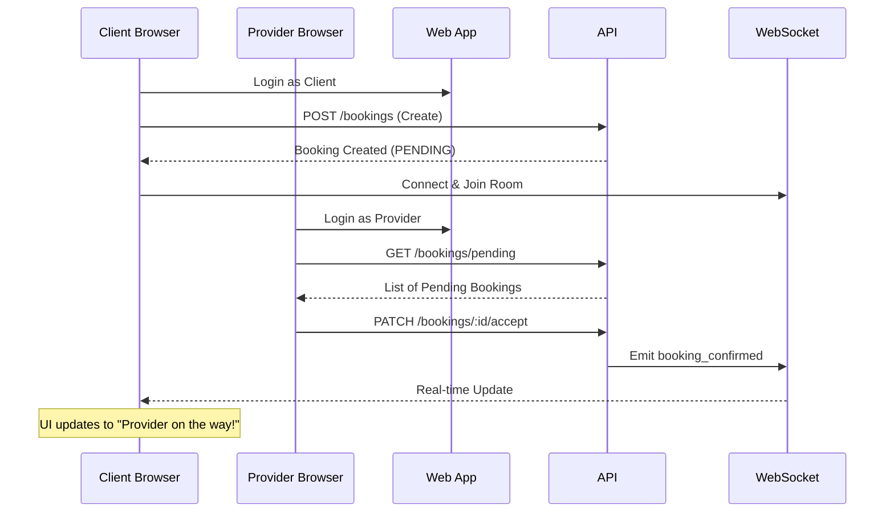

# A2Home E2E Test Documentation

## Overview
End-to-end tests validating the complete booking flow from client request to provider acceptance with real-time WebSocket updates.

## Test Scenarios

### Full Booking Cycle Test
**Location**: `tests/e2e/full-cycle.spec.ts`

**Flow**:


## Running Tests

### Run all E2E tests
```bash
npm run test:e2e
```

### Run with UI Mode (Interactive)
```bash
npm run test:e2e:ui
```

### View HTML Report
```bash
npm run test:e2e:report
```

## Test Configuration
- **Browser**: Chromium (Desktop Chrome)
- **Workers**: 1 (serial execution to avoid conflicts)
- **Video**: Recorded on test execution
- **Trace**: Recorded on retry
- **Base URL**: http://localhost:3001

## Prerequisites
Before running E2E tests:
1. API server must be runnable (`cd packages/api && npm start`)
2. Web app must be runnable (`cd apps/web && npm run dev`)
3. Database must be accessible (PostgreSQL)

## What's Being Tested
✅ Client authentication flow
✅ Booking creation with form inputs
✅ State transition to PENDING
✅ Provider authentication flow
✅ Provider viewing pending bookings
✅ Provider accepting a booking
✅ Real-time WebSocket communication
✅ Client UI updating instantly to CONFIRMED state

## Troubleshooting
- **Timeout errors**: Increase timeout in playwright.config.ts
- **WebSocket not connecting**: Ensure API is running with WebSocket gateway enabled
- **UI elements not found**: Check if Next.js is fully loaded (networkidle state)
